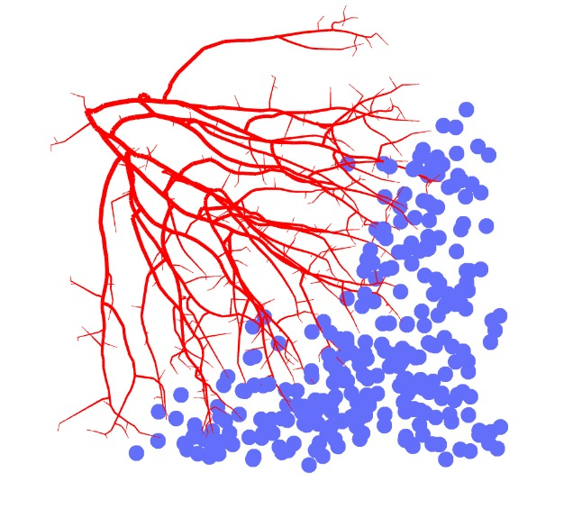
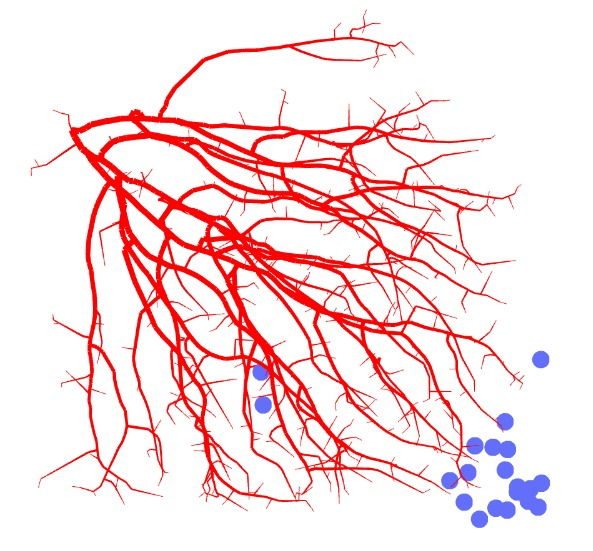

As part of a job application I was asked to consider features for a 3D scan of the subepidermal nerve plexus. However, rather than just looking through the literature, I thought it would be fun to also implement some of them. Unfortunately at this stage in the application process, I do not yet have access to the data. So I thought to generate my own!

This has various benefits, the predominant one that we can use the simulation to understand our features better. Let's say we have a feature which describes the branching factor of the nerves. Then for a certain volume inside the scan (our real data), we find that the branching factor is 0.45. What does this mean? With a simulation, we could visually describe & interpret our features. We can have a progression from 0. to 1. branching factor, giving a much more obvious feeling for what a branching factor of 0.45 means.

The simulation is a vast oversimplification, but it's easy to expand on. As of now, we can control things like thickness, spread & growth direction, and how much it branches. In the future I would like to add additional simulation options such as bundling of multiple fine nerves, and better controls for visualization. Either way, this is enough to at least get a first look at what the simulation looks like!

My implementation is roughly based on [this implementation of space colonization in 2D](https://github.com/jasonwebb/2d-space-colonization-experiments). As you can see, it has a very nice "natural" feel to it, although it's still far from realistic nerve growth. Still, it should suffice for a proof of concept of some features to describe 3D nerve topology!