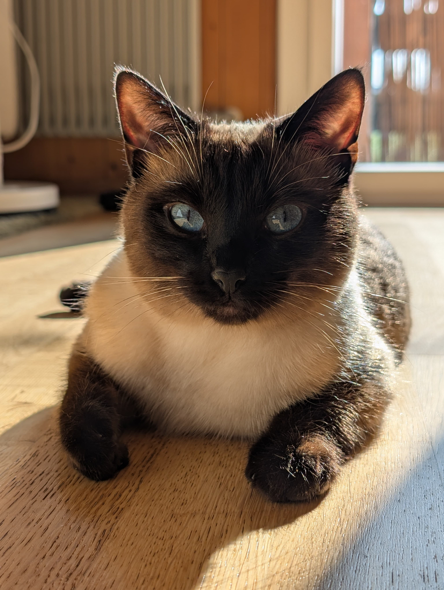
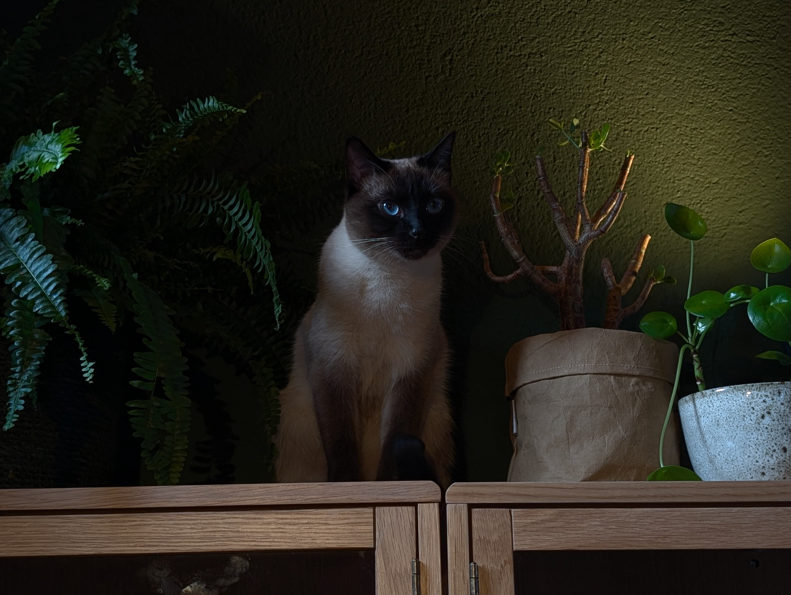
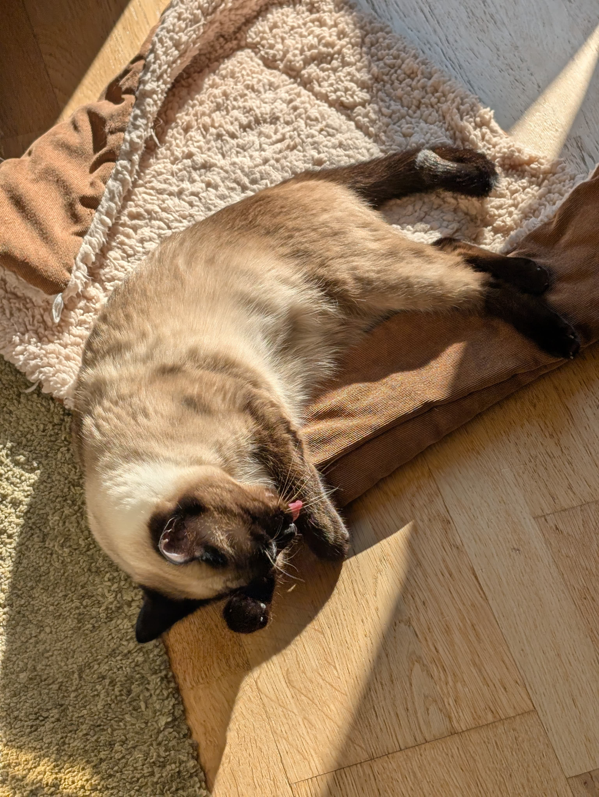
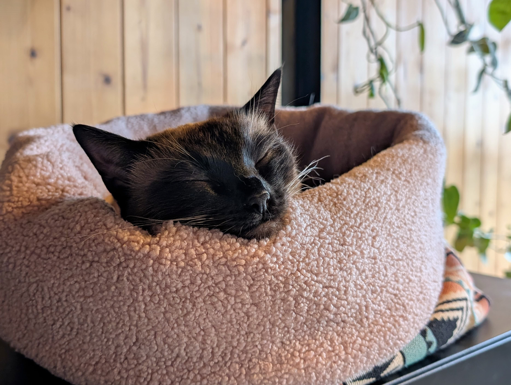

My partner and I wanted pets for as long as we've been together. Unfortunately, along with having pesky things such as "consideration for your pet" and "a moral compass" comes the desire for responsbible ownership. These little critters would be entirely dependent on us for hopefully many many years, and so this was not a decision we could take lightly. Up until recently, our situation was such that we would be out of house for irregular and long stretches at a time. Furthermore, we moved a lot due to studies & career.

Now that we are settling a bit more in Switzerland, and I had a fully remote position, we decided that it was finally time for a pet. Initially we were thinking of adopting a retired greyhound; a cat was not on the radar at all. But the danger in looking for pets online is that you _will_ find pets online. And so we found a listing for Kafi (who was not yet named Kafi at the time)! Kafi was the smallest of the litter, being the 7th, and instantly captured our hearts. He's a pure "Traditional Siamese" from a healthy lineage. 

Even though the "Thai" breed is natural and much closer to the original Siamese cat, officially "Siamese" is a name reserved for the highly selected western style modern breed. As such, to be correct (in the eyes of cat associations), we cannot call Kafi a Siamese. Thankfully, he's our cat and we don't need to be correct. Important to us was that, if we are not going to adopt from a shelter, we wanted the newly born kitten to have the best chances at a happy and healthy life.

One thing that immediately stood out is how calm and accepting he was. He likes to be picked up, appreciates his paws being held, more than tolerates having his nails clipped, and will instantly warm up to anyone. Surprisingly, he's more cautious around other cats than humans! His love for cuddling and acceptance to touch is likely also in parts of how we raised him. From day one we'd make a habit of holding him and massaging his paws as he slept. Another part is that he gets frequent activity. He has a wall dedicated with climbing obstacles, and especially loves chasing (and fetching) long pieces of rope.

As he's an indoors cat, it's important to us that he gets plenty of exercise. Usually when we play with him, he will continue by himself for a while. He also has a handful of cotton balls that he loves playing football with. He's a natural, and much better at it than I am. We leash trained him, and he seems to especially like wearing his harness (perhaps because of his association with getting treats). However, he hates going outside with us unless it's very warm, and then he mostly just sniffs around before sunbathing. Thankfully our balcony is like a solar powered oven even in winter, so he can catch some rays when he really needs to.

Beyond how extremely affectionate and lovable he is, Kafi also often makes us laugh because of how unwittingly silly he can be. For some reason he doesn't really meow, but he has this higher pitched peeps and mews. He uses that to tell us he missed us when we come back from shopping, to tell us how proud he is of how stinky he made his litter box, when he wants to go onto the balcony, and when he wants to eat. He gets canned, grain/sugar free wet food, as we learnt that this is healthier for their kidneys in the long term. Cats generally drink too little, and rely on getting moisture through their food. Having a diet consisting of only dry food can as such cause kidney problems in the long term. We've also noticed that he's much less gluttonous with wet food. He only eats as much as he needs, and we've never had to restrict his diet in any way. We put out a spoonful of dry food at night for him to snack on, but he often doesn't even finish it and wants to enjoy wet food for brunch (he likes to sleep in).

If you've read all that, you must be a die-hard Kafi fan just like we are. So here's one final eepy sleepy Kafi just for you!

