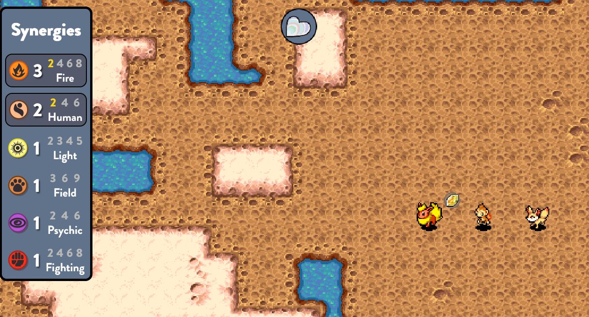

## Analysing game data

Who doesn't want to (over)analyse the games they're playing? Well, even if you wanted to most games don't make their data publicly available. This is why, when a surprisingly deep [auto battler](https://en.wikipedia.org/wiki/Auto_battler) made their data available, I jumped on the opportunity.

## What is PAC

PAC is an open-source auto chess game developed by just two fans. It features art from various commisioned artists and units from an [extremely recognizable franchise](https://en.wikipedia.org/wiki/List_of_highest-grossing_media_franchises). More than that, it has some of the highest variety of unit interaction I have seen in this genre. A match plays out over multiple rounds. Each round, your team automatically fights one of 7 other opponent's team. The loser loses some HP. Afterwards, both the victor and the loser gain some gold to buy new units before the next round starts.

This pattern of team crafting and automated fighting repeats until your HP reaches zero or you're the last player standing. As such the outcome of a game is a ranking between 1 (the winner) and 8 (the first to be eliminated). Your final board state as you win or are eliminated is recorded, including all the units on your board at that time.

## Winrate Analysis

Using this data I look at how often a certain unit appears on the final board, and what the outcome for that board was. As there are too many units and variants to get into, for now I'm limiting myself to a single category ("Uniques"). I also filter out units/variants that were played too infrequently (lowest quantile of play rate). 

In the figure below the x-axis indicates the mean outcome, whereas the y-axis represents the standard deviation of this outcome. This allows us to differentiate between low vs high winrate units as well as the consistency in their placement.

## Interactive Graph

**The plot below is interactive! Try zooming in**



## Conclusion

As you can see, the most played units are of relatively high winrate and high consistency. This means the playerbase knows what they're doing! There's also a tail of lower consistency lower winrate units. As these analysis go, it's always hard to tell which direction the causality goes: are they less popular because they're less consistent, or are they less consistent because they're not played enough? Either way it's good to see that there are no units that are consistently bad, and only one unit that approaches on the "inconsistently" good territory. This might be a problematic unit, as it might be an indication that it completely dominates some games but performs subpar in others. And indeed, with the benefit of hindsight, this unit got changed in the next patch.

> PAC is open source made by [2 fans](https://github.com/keldaanCommunity/pokemonAutoChess). Play on [PAC](https://pokemon-auto-chess.com/)
